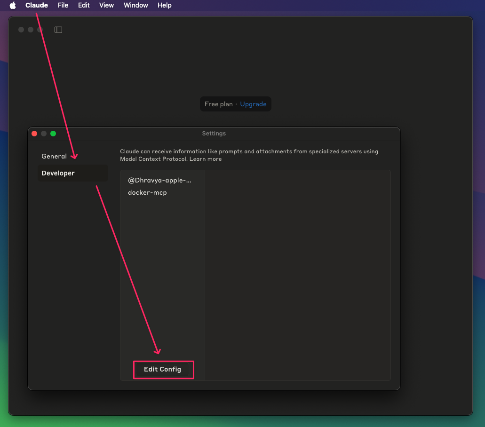

# 🧠 Learning Lesson: Getting Started with MCP Using Claude Desktop

## 🚀 What You'll Learn

By the end of this lesson, you'll be able to:

- Set up **RooCode Extension** as an MCP Client
- Connect RooCode to local and cloud-based MCP Servers
- Use `claude_desktop_config.json` configuration

## 🖥️ Claude Desktop

**Claude Desktop** is a application for general public to interact with AI wia UI with built-in LLM support and native MCP Client functionality. It supports:

- `STDIO` transport protocol only
- A dedicated `claude_desktop_config.json` configuration
- Direct integration with popular local MCP servers

Other supported developer-oriented MCP clients include: Cursor, Windsur, VS Code with Copilot, Cline, Continue (vary in transport & config support).

---

## How to Set Up MCP with Claude Desktop

### 1. **Install Claude Desktop**
Go to [Claude Desktop](https://claude.ai/download) and install the app for your OS.

### 2. **Local MCP Servers Requirements**
In the previous guide you prepared by installing these utils, if you didn't, follow the previous step in [README.md](../README.md):
- With `uv`, `npm`, `bun`.
- Standalone Containers (may support STDIO, SSE or even Streamable-HTTP)
- Via MCP Toolkit from Docker Desktop extension (supports STDIO protocol only)

#### 3 **Cloud MCP Servers**
Some online services have native MCP support (e.g. GitHub, Cloudflare). But Claude Desktop does not support thouse, fortunatelly we can use MCP Proxy to fix that issue.
- https://api.githubcopilot.com/mcp/ (streamable-HTTP only, requires Authentication, [read more](https://github.com/github/github-mcp-server))
- https://docs.mcp.cloudflare.com/sse (SSE transport only, no Auth), see [other Cloudflare's own MCP servers here](https://developers.cloudflare.com/agents/model-context-protocol/mcp-servers-for-cloudflare/).
- https://mcp.deepwiki.com/sse (SSE transport only, no Auth)

### 4. ⚙️ Claude Desktop UI



- Open Claude Desktop
- In the Settings go to "Developer" tab
- Press edit config and open the claude_desktop_config.json with any text editor. 
- Observe the syntax of `claude_desktop_config.json` file. 
- Replace the text with the text from [`mcpServers.json`](../mcpServers.json) and replace DeepWiki per example below using a proxy like this:

Replace this fragment:
```json
    "DeepWiki": {
      "disabled": false,
      "timeout": 15,
      "url": "https://mcp.deepwiki.com/sse",
      "transportType": "sse"
    }
```

With this, using mcp-remote proxy:
```json
    "DeepWiki": {
      "timeout": 60,
      "type": "stdio",
      "command": "npx",
      "args": [
        "-y",
        "mcp-remote",
        "https://mcp.deepwiki.com/sse"
      ],
      "disabled": false
    }
```

Close and reopen Claude Desktop to restart.