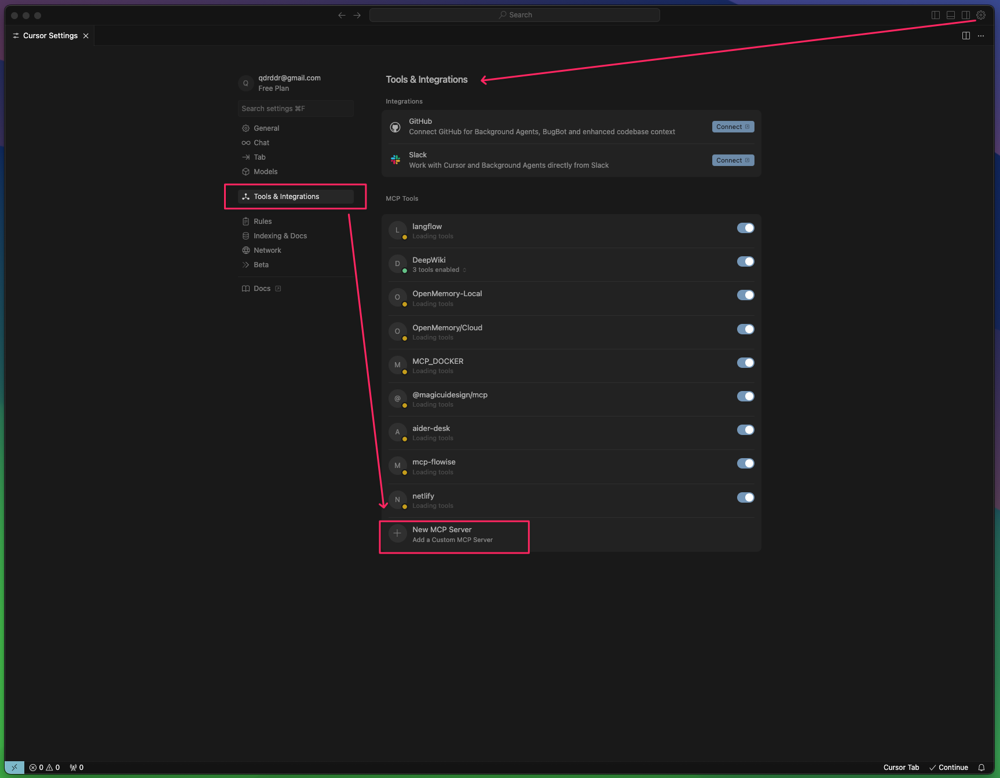

# 🧠 Learning Lesson: Getting Started with MCP Using Cursor

## 🚀 What You'll Learn

By the end of this lesson, you'll be able to:

- Set up **Cursor** as an MCP Client
- Connect Cursor to local and cloud-based MCP Servers
- Use `mcp.json` configuration

## 🖥️ Cursor

**Cursor** is a developer-oriented IDE with built-in LLM support and native MCP Client functionality. It supports:

- `STDIO` and partial `SSE` transport protocols
- A dedicated `mcp.json` configuration
- Direct integration with popular local MCP servers

Other supported developer-oriented MCP clients include: Windsur, VS Code with Copilot, RooCode, Cline, Continue (vary in transport & config support).

---

## ⚙️ How to Set Up MCP with Cursor

### 1. **Install Cursor**
Go to [https://cursor.sh](https://cursor.sh) and install Cursor for your OS.

### 2. **Local MCP Servers Requirements**
In the previous guide you prepared by installing these utils, if you didn't, follow the previous step in [README.md](../README.md):
- With `uv`, `npm`, `bun`.
- Standalone Containers (may support STDIO, SSE or even Streamable-HTTP)
- Via MCP Toolkit from Docker Desktop extension (supports STDIO protocol only)

#### 2.1 **Cloud MCP Servers**
Some online services have native MCP support (e.g. GitHub, Cloudflare).
- https://api.githubcopilot.com/mcp/ (streamable-HTTP only, requires Authentication, [read more](https://github.com/github/github-mcp-server))
- https://docs.mcp.cloudflare.com/sse (SSE transport only, no Auth), see [other Cloudflare's own MCP servers here](https://developers.cloudflare.com/agents/model-context-protocol/mcp-servers-for-cloudflare/).
- https://mcp.deepwiki.com/sse (SSE transport only, no Auth)

### 3. ⚙️ Cursor UI
- Go to Settings
- Select "Tools & Integrations" (Previously "MCP Servers")
- Press "Add New custom MCP Server"
- On the "Tools & Integrations" you can temporarily disable some MCP Servers that is handy when you have too many MCP Servers and tools. Try to keep a few MCP Servers enabled (no more than 50-100 tools), which approximately no more than 5-10 MCP Servers. 
- Update the `mcp.json` config file using example below:

### 4. **In Cursor Update Your `mcpServers.json` File**
For the [Cloud OpenMemory](openmemory.dev), you'll need to register and create an [API key](https://app.openmemory.dev/dashboard).

Example [configuration here](../mcpServers.json).

