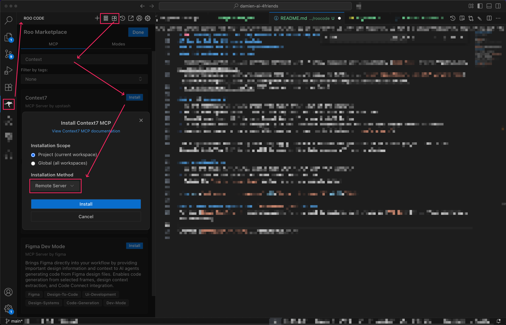

# 🧠 Learning Lesson: Getting Started with MCP Using RooCode Extension

## 🚀 What You'll Learn

By the end of this lesson, you'll be able to:

- Set up **RooCode Extension** as an MCP Client
- Connect RooCode to local and cloud-based MCP Servers
- Use `mcp_settings.json` configuration
- Will take approximately 15 minutes

## **🖥️ RooCode**

**RooCode** is a developer-oriented Extension for VS Code IDE with built-in LLM support and native MCP Client functionality. It supports:

- `STDIO`, `SSE` and `streamable-HTTP` transport protocols
- A dedicated `mcp_settings.json` (Global) & `mcp.json` (per project) configurations
- Direct integration with popular local MCP servers

Other supported developer-oriented MCP clients include: Cursor, Windsurf, VS Code with Copilot, Cline, Continue (vary in transport & config support).

---

## **How to Set Up MCP with RooCode**

### 1. **Install VS Code**
Go to [Code.VisualStudio.com](https://code.visualstudio.com/Download) and install the app for your OS.

### 2. **Install RooCode**
Go to [Marketplace.VisualStudio](https://marketplace.visualstudio.com/items?itemName=RooVeterinaryInc.roo-cline) and install RooCode Extension for your VS Code IDE. Alternatively use the Extension button in VS Code on the left hand side (the four cubes icon with one of the top right cubes falling off) and search for RooCode. Press the `Install` button.

### 3. **Local MCP Servers Requirements**
In the previous guide you prepared by installing these utils, if you didn't, follow the previous step in [README.md](../):
- With `uv`, `npm`, `bun`.
- Standalone Containers (may support STDIO, SSE or even Streamable-HTTP)
- Via MCP Toolkit from Docker Desktop extension (supports STDIO protocol only)

#### 3.1 **Cloud MCP Servers**
Some online services have native MCP support (e.g. GitHub, Cloudflare).
- https://api.githubcopilot.com/mcp/ (streamable-HTTP only, requires Authentication, [read more](https://github.com/github/github-mcp-server))
- https://docs.mcp.cloudflare.com/sse (SSE transport only, no Auth), see [other Cloudflare's own MCP servers here](https://developers.cloudflare.com/agents/model-context-protocol/mcp-servers-for-cloudflare/).
- https://mcp.deepwiki.com/sse (SSE transport only, no Auth)

### 4. **Open VS Code & Create a project**
- Create an empty folder on your computer
- Start VS Code app and open the recently created folder

### 4.1. **⚙️ RooCode UI: MCP Marketplace**
- On the left-hand side panel press "Roo Code" with icon of the Kangaroo
- On the left opened panel, find on the top the four cubes icon of the Roo Code, when hover over "Marketplace"
- Install your first MCP Server: Search Context7, press install button
- In the opened menu select "Project" & in the dropdown "Installation Method" menu choose "Remote Server"
- Observe the syntax of mcp.json file created in your project folder (`.roo/mcp.json`), note the protocol type is "streamable-http" and the URL ends with `/mcp` (that is also an indicator that the transport protocol is streamable-http).

The Project-based MCP config will only apply those MCP Servers for your currently opened project. While the Globally installed MCP Servers will be used by Roo Code across all your projects.

### 4.2. **In RooCode Update Your Global `mcp_settings.json` File**

**Alternatively instead of Marketplace:**
- Go to the three horizontal blocks icon when hover over "MCP Servers"
- Scroll down to and press the "Edit Global MCP" button.
- On the "MCP Servers" you can temporarily disable some MCP Servers that is handy when you have too many MCP Servers and tools. Try to keep a few MCP Servers enabled (no more than 50-100 tools), which approximately no more than 5-10 MCP Servers. 
- Update the `mcp_settings.json` config file using example below

